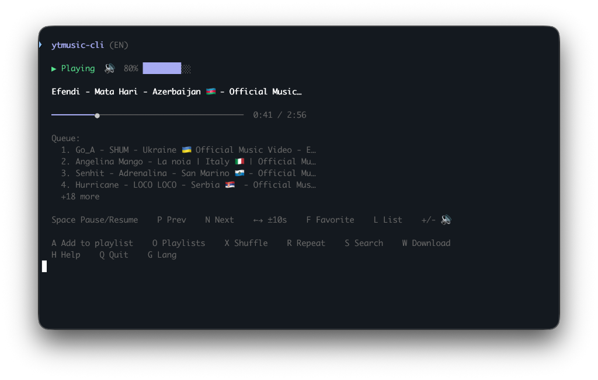
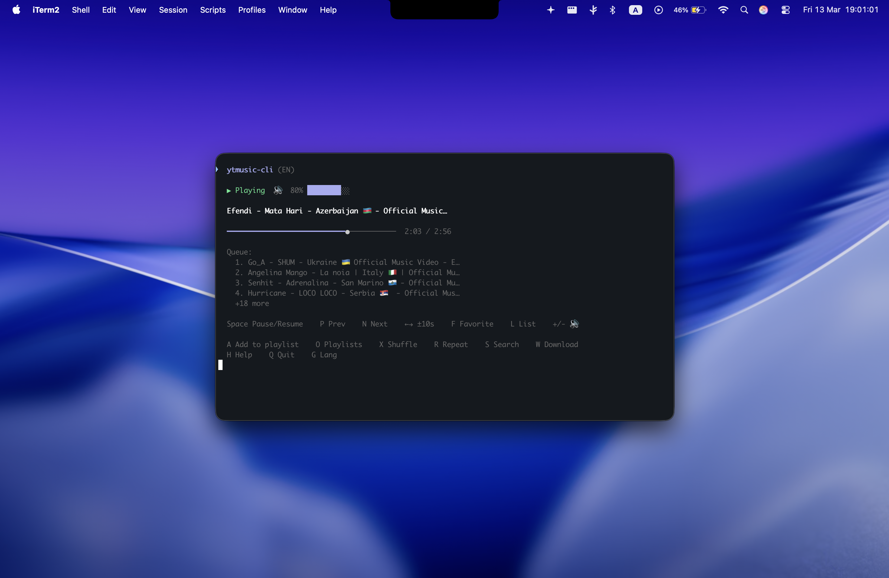

# ytmusic-cli

<div align="center">
  
</div>

YouTube Music player for your terminal. Search and stream music directly from YouTube — no browser, no ads, no distractions.

[](https://opensource.org/licenses/MIT)
[](https://github.com/mammadovziya/ytmusic-cli/releases)
[](https://bun.sh)

---

## Performance-First Experience

`ytmusic-cli` is designed for users who live in the terminal. It provides a lightweight, keyboard-driven interface to the entire YouTube Music library without the overhead of a web browser.

- **Fast & Lightweight** — Native performance powered by [Bun](https://bun.sh).
- **Ad-Free** — Pure music streaming without interruptions.
- **Offline-Ready** — Download your favorites for local playback.
- **Privacy-Focused** — No tracking, just your music.

## Requirements

The player requires the following binaries in your system path:

- **mpv** — Media player backend.
- **yt-dlp** — YouTube stream extractor.

## Installation

### macOS (Recommended)
Install via Homebrew to get everything set up automatically:

```sh
# Tap the repository
brew tap mammadovziya/tap

# Install the player
brew install ytmusic-cli

# You can now use any of these commands:
ytmusic-player
ym
```

### via NPM (Universal)
If you already have a Node.js or Bun environment:

```sh
npm install -g ytmusic-player
```

---

## Controls

The interface is completely keyboard-driven. Below are the primary controls used during playback and navigation.

### Player controls
| Key | Action |
| :--- | :--- |
| **Space** | Pause / Resume |
| **← / →** | Seek -10s / +10s |
| **N** | Next track |
| **P** | Previous track |
| **F** | Toggle favorite |
| **X** | Toggle shuffle |
| **R** | Cycle Repeat (Off / One / All) |
| **U** | View playback queue |
| **I** | Track info & URL |
| **A** | Add to playlist |
| **S** | Back to search |
| **Q / Ctrl+C** | Quit application |

## Interface

The player features a high-fidelity terminal interface, precisely as seen on macOS.

<div align="center">
  
  <p><i>Native terminal UI showcasing live playback, progress tracking, and queue management.</i></p>
</div>

<div align="center">
  
  <p><i>Seamlessly integrates into your macOS workspace.</i></p>
</div>

---

## Features

- **Search & Play** — Instant access to millions of tracks.
- **Radio Mix** — Auto-queues related tracks when your list ends.
- **Playlist Management** — Create and manage local playlists.
- **Multilingual Support** — Available in English, Azerbaijani, and Turkish.
- **Downloads** — Save tracks for offline listening.

## License

Distributed under the MIT License. See `LICENSE` for more information.

---
<div align="center">
  Built with obsession by <b>Ziya Mammadov</b>
</div>
